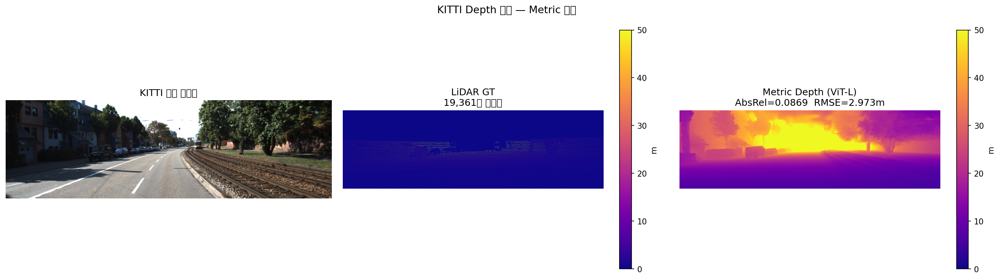

# DriveSplat

**Depth-Guided 3D Gaussian Splatting Initialization**

단안 카메라 영상에서 Depth Anything V2로 추정한 depth map을
3D Gaussian Splatting의 초기화에 활용하는 파이프라인입니다.

---

## 직접 구현한 것 (★)

| 파일 | 내용 |
|------|------|
| `core/scale_alignment.py` | COLMAP anchor 기반 Affine 정렬 설계 (s=-4.3 발견) |
| `core/depth_to_pointcloud.py` | Backprojection 역투영 직접 구현 |
| `core/metrics.py` | KITTI depth 평가 지표, PSNR 직접 계산 |
| `core/ply_utils.py` | 3DGS 포맷 PLY 저장 |

---

## KITTI Depth 평가 결과

| 방법 | AbsRel | RMSE | delta<1.25 |
|------|--------|------|------------|
| Relative + Linear | 1.2152 | 20.554m | 0.1249 |
| Relative + Affine (★ 직접 설계) | 0.3306 | 7.193m | 0.3910 |
| **Metric ViT-L (최종)** | **0.0869** | **2.973m** | **0.9505** |

핵심 발견:
- Depth Anything V2 Relative는 Disparity 방식 출력 (scale s = -4.3)
- Affine 정렬로 AbsRel 1.22 → 0.33 (4배 개선)
- Metric 모델 교체 후 AbsRel 0.087 달성 (14배 개선)

---

## Ablation Study

| Method | Init Points | PSNR |
|--------|------------|------|
| A) COLMAP only (baseline) | 136,029 | **25.15 dB** |
| B) Depth only | 656,224 | 18.89 dB |
| C) COLMAP + Depth (per-frame) | 792,253 | 18.85 dB |
| D) COLMAP + Depth (global) | 1,477,895 | ~19.5 dB |

Scale Variance (σ=0.27)가 PSNR 저하의 근본 원인 → Metric 모델로 해결

---

## 환경

- Python 3.12 / PyTorch 2.x / CUDA 12.x
- Google Colab T4 GPU

## 참고 논문

- Kerbl et al., "3D Gaussian Splatting", SIGGRAPH 2023
- Yang et al., "Depth Anything V2", NeurIPS 2024
